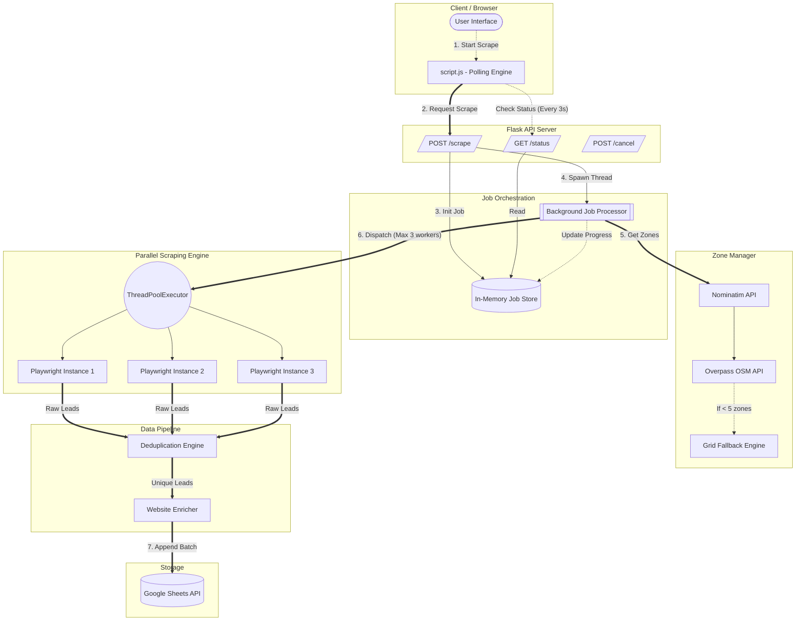

# BrainMap AI Lead Scraper: System Architecture

This document provides a comprehensive overview of the system architecture, flowcharts, fallback mechanisms, and API request/response structures for the Maps Leads Scraper system.

---

## 1. System Architecture Flowchart



---

## 2. API Request/Response Queries

The system uses an asynchronous, job-based API architecture to prevent timeouts on long-running scrapes.

### A. Start Scrape `POST /scrape`
Initiates a new scraping job in the background.

**Request Body:**
```json
{
  "term": "automotive",
  "location": "Bengaluru",
  "max_results": 500,
  "zone_split": true
}
```

**Response (200 OK):**
```json
{
  "job_id": "21b875bd",
  "status": "started"
}
```

### B. Poll Status `GET /status/<job_id>`
Called by the frontend every 3 seconds to update the UI progress bar.

**Response (200 OK):**
```json
{
  "job_id": "21b875bd",
  "status": "running",         // 'starting', 'running', 'completed', 'cancelled', 'failed'
  "progress_pct": 25,
  "total_zones": 9,
  "zones_completed": 2,
  "current_zone": "Koramangala",
  "leads_found": 84,
  "errors": []
}
```

### C. Cancel Job `POST /cancel/<job_id>`
Stops a currently running job (what has already been saved to the sheet remains saved).

**Response (200 OK):**
```json
{
  "status": "cancelling"
}
```

---

## 3. Fallback Mechanisms

The system employs robust gracefully-degrading fallbacks at almost every layer to maximize lead recovery.

### A. Geographic Zone Fallbacks (Zone Manager)
Used when trying to break down a large area into smaller search queries.
1. **Primary**: Fetch OpenStreetMap (OSM) `suburb`/`neighbourhood` tags via the Overpass API using a bounding box.
2. **Fallback 1**: If OSM fails or returns fewer than 5 zones, fall back to **Grid-Based Splitting**, mathematically slicing the bounding box into a lat/lng grid.
3. **Fallback 2**: Generate broad descriptive area strings (e.g., `"Old {City} market area"`, `"near railway station {City}"`)

### B. Scraping Operations Fallback
Used during the Playwright execution to prevent target pages from breaking the scraper.
1. **Adaptive Scroll Fallback**: Scrolls the feed dynamically until the `span.HlvSq` "End of list" text marker appears.
   * *Fallback*: If the text marker is missing, the scraper tracks the raw node count. If the underlying node count doesn't increase after 4 scroll attempts, it safely assumes it has hit the bottom.
2. **DOM Load Fallback**: When clicking a place, it waits for the `h1.fontHeadlineLarge` header to appear (max 4s). 
   * *Fallback*: If Google Maps uses a different DOM layout (A/B testing) and the selector doesn't appear, it falls back to a blind 1.5s timeout.
3. **Query Fallback**: If a specific query (e.g., `"automotive in North Jaipur"`) returns exactly 0 results on the first attempt, the Thread Worker waits 2 seconds and **retries** once before abandoning the zone.

### C. Deduplication Fallbacks
Used when determining if a lead has already been scraped across different zones.
1. **Primary Key**: Compare the absolute canonical `maps_url` (most accurate fingerprint).
2. **Secondary Key**: If the URL isn't captured, it matches `(Normalized Name + Phone Number)`.
3. **Tertiary Key**: If the business has no phone number listed, it matches `(Normalized Name + Address)`.
4. **Cross-Run Fallback**: At startup, the scraper downloads all existing URLs/names directly from the user's remote Google Sheet into memory. This prevents scraping the same leads across completely decoupled system runs on different days.

### D. Parsing & Enrichment Fallbacks
Used when parsing specific messy text or enriching websites.
1. **Website Error Fallback**: If the business website is dead, times out, or throws a 404, the enricher gracefully catches the exception and returns empty strings instead of crashing the batch.
2. **Regex Phone Parsing**: If Google Maps hides the phone number behind an obscure button class, the system falls back to a global regex search `(\+?\d[\d\s\-]{8,}\d)` across the entire loaded panel text data.
3. **Email Validation Fallback**: Prevents grabbing image extensions disguised as emails (`.png`, `.jpg`) and ignores generic unhelpful domains (`sentry.io`, `wix.com`, `example.com`).
